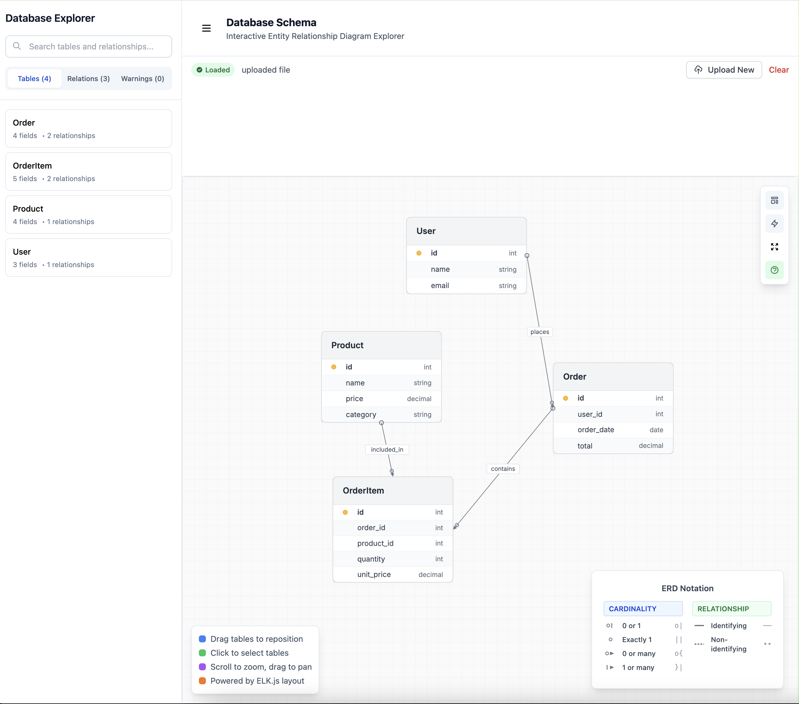

# Mermaid ERD Visualizer

A powerful web application for visualizing Entity Relationship Diagrams from Mermaid syntax, optimized for **large and complex ERD diagrams**.



_Interactive ERD visualization showing database schema with tables, relationships, and an intuitive sidebar for navigation._

## ✨ Features

- **Large Diagram Support**: Efficiently handles and renders large, complex ERD diagrams
- **Interactive Visualization**: Pan, zoom, and explore your database schemas
- **Mermaid Parser**: Comprehensive parsing and validation of Mermaid ERD syntax

## Development

Run the dev server:

```sh
npm install
npm run dev
```

## Tech Stack

- **Frontend**: React, Remix, TypeScript
- **Visualization**: D3.js, ELK.js
- **Styling**: Tailwind CSS
- **Parser**: Custom Mermaid ERD parser

## License

MIT
