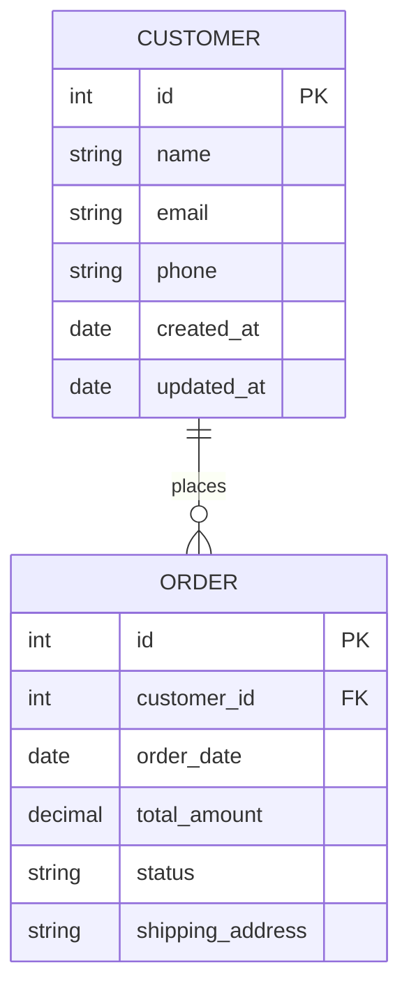

# Single HTML Export - ERD Explorer

The ERD Explorer can be exported as a single, standalone HTML file that contains all the necessary JavaScript, CSS, and an embedded ERD diagram. This file can be opened in any modern web browser without requiring a server.

## Building the Single HTML Export

To create a single HTML file:

```bash
npm run build:singlehtml
```

This will:
1. Build the application using Vite
2. Inline all CSS and JavaScript into a single HTML file
3. Create `erd-explorer-standalone.html` in the project root

## Using the Single HTML Export

### Default Behavior

The standalone HTML file will automatically load the embedded ERD diagram when opened in a browser. The ERD diagram is embedded as a placeholder that can be easily replaced.

### Disabling Auto-Load

To prevent the automatic loading of the embedded ERD diagram, add `?auto=false` to the URL:

```
file:///path/to/erd-explorer-standalone.html?auto=false
```

### Uploading Custom ERD Files

Even with the embedded diagram, you can still upload new ERD files using the "Upload New" button in the interface.

## Replacing the ERD Diagram

### Method 1: Using the Replacement Script

Use the provided Node.js script to replace the ERD diagram:

```bash
node scripts/replace-erd.js erd-explorer-standalone.html your-erd-file.mmd
```

**Example:**
```bash
node scripts/replace-erd.js erd-explorer-standalone.html app/data/test-erd.mmd
```

### Method 2: Manual Replacement

1. Open `erd-explorer-standalone.html` in a text editor
2. Find the ERD variable at the top of the JavaScript:
   ```javascript
   // ERD Diagram - Replace this variable with your ERD content
   window.ERD_DIAGRAM = `erDiagram
       // ... existing ERD content ...
   `;
   ```
3. Replace the content between the backticks with your ERD diagram
4. Save the file

## ERD Format Requirements

The ERD diagram must:
- Start with `erDiagram`
- Use valid Mermaid ERD syntax
- Be properly formatted

**Example ERD:**


## File Structure

The single HTML export contains:
- **All JavaScript dependencies** (React, D3.js, ELK.js, Mermaid.js)
- **All CSS styles** (Tailwind CSS and custom styles)
- **Embedded ERD diagram** (as a replaceable placeholder)
- **Complete functionality** (drag & drop, zoom, pan, sidebar navigation)

## Browser Compatibility

The standalone HTML file works in:
- Chrome 70+
- Firefox 70+
- Safari 12+
- Edge 79+

## File Size

The generated HTML file is approximately 4.2 MB and includes all dependencies inline. This ensures it works completely offline without any external dependencies.

## Security Features

The standalone version maintains all security features:
- File type validation
- Content validation
- XSS protection
- Safe ERD parsing

## Use Cases

Perfect for:
- **Documentation**: Embed database schemas in documentation
- **Presentations**: Standalone files for presentations
- **Distribution**: Share database schemas without setup
- **Offline viewing**: View ERD diagrams without internet
- **Static hosting**: Deploy to static file servers

## Troubleshooting

### ERD Not Loading
- Ensure the ERD starts with `erDiagram`
- Check that the ERD syntax is valid Mermaid format
- Verify the `window.ERD_DIAGRAM` variable is properly formatted

### File Size Issues
- The file is large (~4.2 MB) due to inline dependencies
- Consider using a CDN version if file size is critical
- Use gzip compression when serving the file

### Browser Compatibility
- Ensure JavaScript is enabled
- Try a different browser if issues persist
- Check browser console for error messages

## Advanced Usage

### Custom Styling
You can modify the inline CSS in the HTML file to customize the appearance of the ERD Explorer.

### Multiple ERD Files
Create multiple HTML files with different ERD diagrams for different database schemas.

### Integration
The HTML file can be embedded in iframes or used as a standalone application.